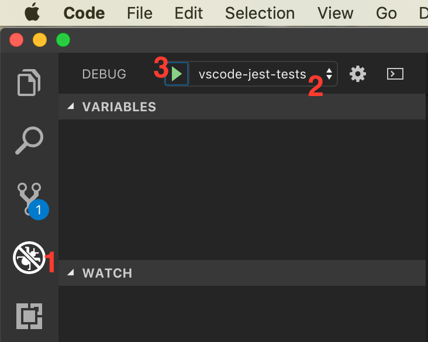

# Rental Property Calculator

[Website](https://secure-plateau-58035.herokuapp.com/)

## Description

Rental Property Calculator is a web application for analyzing potential rental property investments. It allows you to see a property's value, cash flow, equity buildup, return on investment, return on equity, and cash on cash return for the years during the mortgage and after the property is paid off.

The application has a login system that allows you to save your analyses and view/modify them in the future. Eventually, export to Excel and PDF formats will also be supported.

## Development

The front end tech stack includes [React](https://github.com/facebook/react), [Redux](https://github.com/reduxjs/redux), [Webpack](https://github.com/webpack/webpack), and [Babel](https://github.com/babel/babel).

The server is written using [Express](https://github.com/expressjs/express).

Testing is done using [Jest](https://github.com/facebook/jest), [Chai](https://github.com/chaijs/chai), and [Enzyme](https://airbnb.io/enzyme/).

### How to run

1. Clone or download this repository.  Navigate to the project root.
2. Install dependencies: `npm install`
3. In one terminal window, start the server: `npm run start`
4. In another terminal window, start the client: `npm run client`

Client-side debugging is done using browser developer tools. Server-side debugging can be done in VS Code by using the **debug server** configuration (launch the same way as for [debugging tests](###Testing)).

### Testing

Run tests: `npm test`

Tests can also be run and debugged inside VS Code using the **vscode-jest-tests** configuration (open the Debug panel from the Activity Bar and select that configuration in the dropdown at the top).

